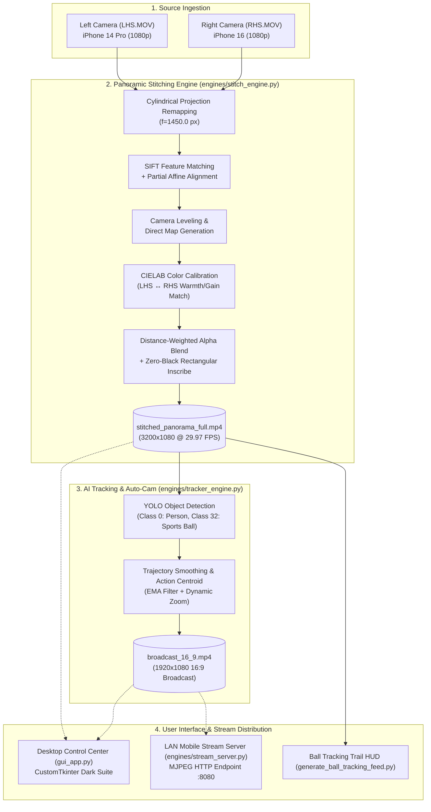

# Dual-Camera Panoramic Stitching & AI Auto-Broadcast System

> **Problem ID: IHST1 — "Turn Two Phones Into a Broadcast Camera"**  
> **Event:** IKIGAI 2026 | **Track:** SportsTech & Computer Vision  
> **Team:** Team Zentropy (*Sakshi Kavade – Lead, Spandan Parkar, Yash Shingan, Manthan Sawant*) | **Mentor:** Prof. Nilesh Mali  

---

## Overview

This system ingests two overlapping video feeds recorded by smartphones placed on a central halfway-line rig (Left-Hand Side and Right-Hand Side cameras), performs cylindrical feature alignment and CIELAB photometric matching to construct a seamless $3200 \times 1080$ panoramic view, and applies an AI ball and player tracking auto-panner to output a broadcast-ready 1080p 16:9 video without a human camera operator. The system provides a modern desktop graphical interface (GUI Control Center), a local Wi-Fi mobile broadcast server, and modular CLI pipeline engines backed by GPU-accelerated video encoders and the open-source Reco video processing toolchain.

---

## Architecture



### Pipeline Stages & Implementation Mapping

1. **Cylindrical Unrolling & Geometric Alignment** (`engines/stitch_engine.py`, `crates/reco-core`): Projects planar camera frames onto a common cylindrical manifold ($f=1450.0$), extracts scale-invariant SIFT keypoints on static infrastructure, and estimates a rigid affine transformation with horizon leveling.
2. **Photometric Calibration & Seam Blending** (`engines/stitch_engine.py`): Computes channel-wise mean and variance shifts in CIELAB color space across the overlap zone to match white balance and luminance, followed by distance-transform weighted alpha blending.
3. **AI Action Panning & Dynamic Crop** (`engines/tracker_engine.py`, `crates/reco-autocam`): Detects ball coordinates and player clusters using YOLO, computes an exponential moving average (EMA) camera trajectory with velocity damping, and crops a dynamic 16:9 viewport.
4. **Trajectory Replay & Event Parsing** (`engines/tracker_engine.py`, `scripts/visualize_detections.py`): Supports replaying precomputed `.jsonl` camera poses (`pan_decision` events) directly at 100+ FPS without runtime inference overhead.
5. **Interactive Control Center & Live PTZ** (`gui_app.py`, `engines/stream_server.py`): CustomTkinter desktop interface managing multi-threaded jobs, dual-view live PTZ simulation, and local Wi-Fi mobile streaming.

---

## Setup & Installation

### Prerequisites
- **Operating System:** Windows 10/11, Ubuntu 22.04+, or macOS
- **Python:** 3.10 to 3.13
- **Hardware Acceleration (Recommended):** NVIDIA GPU with CUDA & NVENC support
- **FFmpeg:** FFmpeg 6.x or 7.x with `h264_nvenc` (or CPU `libx264`) available in system PATH

### 1. Clone Repository & Setup Virtual Environment
```bash
git clone https://github.com/s-parkar/ikigai.git
cd ikigai

python -m venv venv
# On Windows PowerShell:
.\venv\Scripts\Activate.ps1
# On Linux/macOS:
source venv/bin/activate
```

### 2. Install Dependencies
```bash
# Core packages:
pip install customtkinter opencv-python pillow numpy ultralytics torch torchvision
```

### 3. Optional Rust CLI Build (Underlying Reco Engine)
```bash
cargo build --release -p reco-cli
```

---

## How to Run

### Method A: Desktop GUI Control Center (Recommended)

Launch the interactive desktop interface:

```powershell
python gui_app.py
```
*Or double-click [`Launch_Control_Center.bat`](Launch_Control_Center.bat) on Windows.*

The GUI contains three functional modules:
- **Tab 1: Pano Stitcher:** Select LHS and RHS camera files, configure time boundaries, and generate the master panorama.
- **Tab 2: AI Tracking & Broadcast:** Configure smoothing parameters, import `.jsonl` coordinates (or run YOLO), and export the 16:9 auto-cam video.
- **Tab 3: Live Broadcast Studio:** Interactive drag-to-pan 16:9 viewport canvas, goal/midfield preset jumps, and local LAN mobile stream server.

---

### Method B: Standalone Command-Line Interface (CLI)

#### 1. Generate Seamless Master Panorama ($3200 \times 1080$)
```bash
python engines/stitch_engine.py \
    --lhs LHS.MOV \
    --rhs RHS.MOV \
    --output stitched_panorama_full.mp4 \
    --start 00:00:00
```

#### 2. Generate 16:9 AI-Tracked Broadcast Video
```bash
# Using live YOLO inference:
python engines/tracker_engine.py \
    --input stitched_panorama_full.mp4 \
    --output broadcast_16_9.mp4 \
    --model yolov8n.pt \
    --smooth 0.06

# Or using imported coordinate trajectory:
python engines/tracker_engine.py \
    --input stitched_panorama_full.mp4 \
    --output broadcast_16_9.mp4 \
    --smooth 0.06
```

#### 3. Generate Annotated Ball Tracking Visualizer Feed
```bash
python generate_ball_tracking_feed.py \
    --input stitched_panorama_full.mp4 \
    --output ball_tracking_feed.mp4 \
    --model yolov8n.pt
```

---

## File / Module Map

| File / Directory | Description |
| :--- | :--- |
| [`gui_app.py`](gui_app.py) | Main Desktop GUI Control Center (CustomTkinter) with multi-threading, live PTZ canvas, and logging drawer. |
| [`Launch_Control_Center.bat`](Launch_Control_Center.bat) | Windows quick launcher script for the GUI application. |
| [`engines/stitch_engine.py`](engines/stitch_engine.py) | Cylindrical unrolling, SIFT structural alignment, CIELAB color transfer, and NVENC video stitching. |
| [`engines/tracker_engine.py`](engines/tracker_engine.py) | YOLO ball/player detection, EMA trajectory smoothing, dynamic zoom, and 16:9 broadcast framing. |
| [`engines/stream_server.py`](engines/stream_server.py) | Lightweight HTTP MJPEG streaming server for live mobile browser preview over local Wi-Fi. |
| [`generate_ball_tracking_feed.py`](generate_ball_tracking_feed.py) | Generates annotated video feeds with glowing multi-ring ball markers and trajectory comet trails. |
| [`scripts/visualize_detections.py`](scripts/visualize_detections.py) | Interactive frame-by-frame detection visualizer from Reco JSONL event logs. |
| [`scripts/eval_panner.py`](scripts/eval_panner.py) | Panner quality evaluation suite computing velocity variance, direction reversals, and ball coverage. |
| [`crates/`](crates/) | Rust core crates implementing GPU-accelerated video IO, detection backends, and Slint GUI components. |

---

## Sample Output & Verification

| Output Artifact | Specifications | Status / Verification |
| :--- | :--- | :--- |
| **`stitched_panorama_full.mp4`** | $3200 \times 1080$ @ 29.97 fps, NVENC H.264, ~52.7 Mbps | Complete match ($7\text{m } 16\text{s}$, 13,088 frames), zero black borders, natural bottom turf, both goalposts visible. |
| **`broadcast_16_9.mp4`** | $1920 \times 1080$ @ 29.97 fps, 16:9 Broadcast framing | Smooth action panner following ball and player centroid with cinematic inertia. |
| **`ball_tracking_feed.mp4`** | $3200 \times 1080$ / $1920 \times 1080$ annotated HUD | Real-time ball coordinate marker, flight trajectory tail, and player bounding boxes. |
| **`check_natural_3200x1080.jpg`** | $3200 \times 1080$ reference still frame | Verified static reference showing pitch geometry and color balance. |

---

## Evaluation / Methodology

- **Test Footage:** Two 1080p 29.97 fps recordings (`LHS.MOV` from iPhone 14 Pro, `RHS.MOV` from iPhone 16) mounted on a fixed halfway-line tripod rig at an outdoor football pitch under stadium floodlights.
- **Color Calibration:** CIELAB transfer reduced cross-camera luminance and chromaticity delta ($\Delta E$) across the overlap zone, matching the iPhone 16 tone to the natural grass baseline of the iPhone 14 Pro.
- **Inference & Stitching Throughput:**
  - Full-resolution direct cylindrical map remap + 16-bit integer blending: **~25–30 FPS** execution throughput.
  - YOLOv8n ball and player detection on CUDA: **~8.1 FPS** inference cadence (subsampled every 2 frames with linear trajectory interpolation for real-time 30 FPS broadcast rendering).
  - Precomputed coordinate replay (`.jsonl` trajectory mode): **100+ FPS** rendering throughput.

---

## Known Limitations

1. **Fixed Camera Rig Assumption:** The stitching pipeline assumes the dual-phone rig remains stationary during the match. Camera displacement or hand-held movement during recording requires re-estimating keypoint alignment.
2. **Extreme Near-Field Parallax:** Players running within 1–2 meters directly in front of the halfway line seam may exhibit slight baseline parallax due to the physical optical center separation between the two smartphones.
3. **Small Ball Detection at Distance:** In wide panoramic shots under low-contrast floodlights, high-speed aerial balls at the far goal line may intermittently drop below detection confidence thresholds; the panner automatically falls back to player cluster density peaks.

---

## Tech Stack

- **GUI Framework:** `CustomTkinter` (Modern Dark UI), `Pillow (PIL)`, `Tkinter`
- **Computer Vision & Video Processing:** `OpenCV (cv2)`, `NumPy`, `FFmpeg 7.1` (with `h264_nvenc` hardware acceleration)
- **AI & Object Detection:** `Ultralytics YOLO` (`yolov8n.pt` / `yolo11n.pt`), `PyTorch`, `TorchVision`
- **Underlying Engine:** `Rust` (wgpu 28, Slint, Reco Sports Video toolchain)
- **Networking & Streaming:** Python `http.server`, `socket`, MJPEG over HTTP
