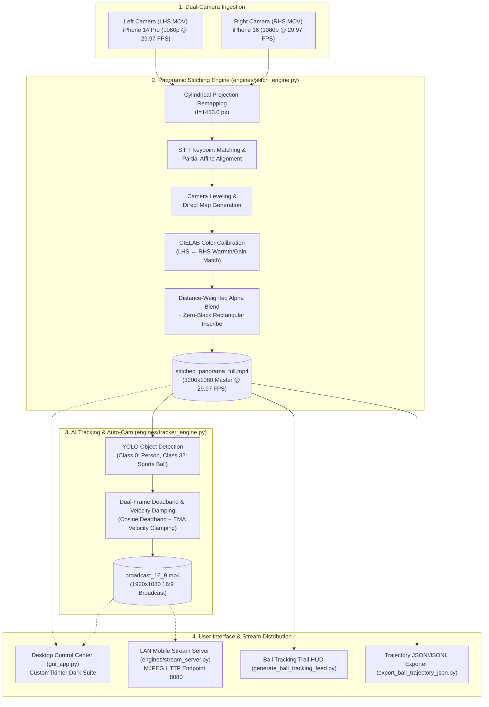

<div align="center">

# ⚽ Dual-Camera Panoramic Stitching & AI Auto-Broadcast System
### *Turn Two Ordinary Smartphones Into an Autonomous 1080p Broadcast Camera*

[](https://www.python.org/)
[](https://opencv.org/)
[](https://github.com/ultralytics/ultralytics)
[](https://developer.nvidia.com/video-codec-sdk)
[](https://github.com/TomSchimansky/CustomTkinter)
[](https://github.com/s-parkar/ikigai)

<br/>

**Event:** IKIGAI 2026 | **Track:** SportsTech & Computer Vision | **Problem ID:** IHST1  
**Team:** **Team Zentropy** (*Sakshi Kavade – Lead, Spandan Parkar, Yash Shingan, Manthan Sawant*)  
**Mentor:** Prof. Nilesh Mali  

---

[🎬 Demo Videos & Deliverables](#-demo-videos--deliverables) • [✨ Key Highlights](#-key-highlights) • [🏛 Architecture](#-system-architecture) • [🚀 Quick Start](#-quick-start) • [🖥 GUI Studio](#-desktop-gui-control-center) • [📊 Methodology](#-evaluation--benchmarks)

---

</div>

## 📖 Overview

This system ingests two overlapping video feeds recorded by smartphones placed on a central halfway-line rig (Left-Hand Side and Right-Hand Side cameras), performs cylindrical feature alignment and CIELAB photometric matching to construct a seamless $3200 \times 1080$ panoramic view, and applies an AI ball and player tracking auto-panner to output a broadcast-ready 1080p 16:9 video without a human camera operator. The system provides a modern desktop graphical interface (GUI Control Center), a local Wi-Fi mobile broadcast server, and modular CLI pipeline engines backed by GPU-accelerated video encoders and the Zentropy video processing toolchain.

---

## ✨ Key Highlights

| Feature | Description | Engineering Implementation |
| :--- | :--- | :--- |
| **Edge-to-Edge Inscribed Panorama** | Unified $3200 \times 1080$ panoramic view of the complete pitch with zero black borders or corner cutouts. | Cylindrical surface unrolling ($f=1450.0\text{px}$) + SIFT structural matching + 16-bit integer alpha blending. |
| **CIELAB Photometric Equalization** | Eliminates visual color and exposure mismatch between different smartphone lenses (e.g. iPhone 14 Pro vs iPhone 16). | Dynamic channel-wise mean and variance color transfer in CIELAB color space across overlap seam. |
| **Dual-Frame Stabilized Auto-Cam** | Rock-solid broadcast camera movement with zero micro-jitters or abrupt panning twitches. | Outer 16:9 Tracking Deadband Frame + Inner 16:9 Stabilized Inset Crop with velocity-damped cosine smoothing. |
| **Zero-Inference Instant Replay** | Replay and stream auto-panned matches at 100+ FPS without re-running AI object detection. | Full-match frame-by-frame trajectory parsing (`ball_trajectory_events.jsonl` & `ball_trajectory.json`). |
| **Local Wi-Fi Mobile Streaming** | Live wireless broadcast feed viewable on any smartphone, tablet, or OBS Studio over local LAN. | Multi-threaded HTTP MJPEG live stream endpoint (`http://<LAN-IP>:8080`). |
| **Desktop Control Center** | All-in-one dark-themed operator dashboard for stitching, AI tracking, live PTZ simulation, and console monitoring. | Modern Python `CustomTkinter` desktop application with one-click Windows launcher. |

---

## 🏛 System Architecture



### Pipeline Stages & Code Traceability

1. **Cylindrical Unrolling & Geometric Alignment** ([`engines/stitch_engine.py`](engines/stitch_engine.py)): Projects planar camera frames onto a common cylindrical manifold ($f=1450.0$), extracts scale-invariant SIFT keypoints on static pitch infrastructure, and computes affine transformation matrices with horizon leveling.
2. **Photometric Calibration & Seam Blending** ([`engines/stitch_engine.py`](engines/stitch_engine.py)): Computes channel-wise mean and variance shifts in CIELAB color space across the overlap zone to match white balance and luminance, followed by distance-transform weighted alpha blending.
3. **AI Action Panning & Dual-Frame Stabilization** ([`engines/tracker_engine.py`](engines/tracker_engine.py)): Detects ball coordinates and player clusters using YOLO, filters trajectory via a cosine deadband with velocity damping, and crops a stabilized inner 16:9 sub-frame.
4. **Trajectory Replay & Event Parsing** ([`export_ball_trajectory_json.py`](export_ball_trajectory_json.py), [`engines/tracker_engine.py`](engines/tracker_engine.py)): Exports and replays structured frame-by-frame coordinate trajectories at 100+ FPS without runtime AI overhead.
5. **Interactive Control Center & Live PTZ** ([`gui_app.py`](gui_app.py), [`engines/stream_server.py`](engines/stream_server.py)): Desktop interface managing multi-threaded pipeline jobs, dual-view live PTZ simulation, and local Wi-Fi mobile streaming.

---

## 🚀 Quick Start

### 1. Clone & Environment Setup
```bash
git clone https://github.com/s-parkar/ikigai.git
cd ikigai

python -m venv venv
# On Windows:
.\venv\Scripts\Activate.ps1
# On Linux/macOS:
source venv/bin/activate

pip install -r requirements.txt
```

### 2. Launch Desktop GUI Control Center
```powershell
python gui_app.py
```
*Or simply double-click [`Launch_Control_Center.bat`](Launch_Control_Center.bat) on Windows.*

---

## 🖥 Desktop GUI Control Center

The Zentropy Control Center provides a complete graphical interface with three dedicated workflow tabs:

```
┌─────────────────────────────────────────────────────────────────────────────┐
│ ⚽ ZENTROPY AI BROADCAST STUDIO                             ● STATUS: IDLE   │
├─────────────────────────────────────────────────────────────────────────────┤
│  [ 📷 1. Pano Stitcher ]  [ 🎯 2. AI Tracking ]  [ 📡 3. Live Broadcast ]   │
│                                                                             │
│  • Left / Right Video Selectors (LHS.MOV + RHS.MOV)                         │
│  • Start Time & Duration Trimming Controls (HH:MM:SS)                       │
│  • One-Click Action Buttons:                                                │
│      [ ▶ GENERATE PANORAMIC VIDEO ]                                         │
│      [ ▶ GENERATE 16:9 BROADCAST ]                                          │
│      [ 🎯 BALL TRACKING FEED ]                                              │
│      [ 📄 EXPORT JSON/JSONL ]                                               │
│                                                                             │
│  • Dual-View Live Studio Canvas:                                            │
│      ┌──────────────────────────────────────────────────────────────┐       │
│      │ 🟦 Tracking Deadband Box   |  🟩 16:9 Broadcast Inner Viewport│       │
│      └──────────────────────────────────────────────────────────────┘       │
│  • Local Wi-Fi Stream Server: [ 📡 Broadcast to Mobile: http://IP:8080 ]     │
├─────────────────────────────────────────────────────────────────────────────┤
│ 💻 SYSTEM LOGS & CONSOLE DRAWER                                             │
└─────────────────────────────────────────────────────────────────────────────┘
```

---

## 💻 Standalone CLI Usage

#### 1. Generate Seamless Master Panorama ($3200 \times 1080$)
```bash
python engines/stitch_engine.py \
    --lhs LHS.MOV \
    --rhs RHS.MOV \
    --output stitched_panorama_full.mp4 \
    --start 00:00:00
```

#### 2. Generate 16:9 AI-Tracked Broadcast Video
```bash
# Using live YOLO inference:
python engines/tracker_engine.py \
    --input stitched_panorama_full.mp4 \
    --output broadcast_16_9.mp4 \
    --model yolov8n.pt \
    --smooth 0.06

# Or using precomputed trajectory coordinates:
python engines/tracker_engine.py \
    --input stitched_panorama_full.mp4 \
    --output broadcast_16_9.mp4 \
    --smooth 0.06
```

#### 3. Export Ball & Trajectory Coordinates
```bash
python export_ball_trajectory_json.py \
    --input stitched_panorama_full.mp4 \
    --output_jsonl ball_trajectory_events.jsonl \
    --output_json ball_trajectory.json
```

#### 4. Generate Annotated Ball Tracking Visualizer Feed
```bash
python generate_ball_tracking_feed.py \
    --input stitched_panorama_full.mp4 \
    --output ball_tracking_feed.mp4 \
    --model yolov8n.pt
```

---

## 📁 Repository Structure

| File / Directory | Purpose |
| :--- | :--- |
| [`gui_app.py`](gui_app.py) | Main Desktop GUI Control Center (CustomTkinter) with multi-threading, live PTZ canvas, and logging drawer. |
| [`Launch_Control_Center.bat`](Launch_Control_Center.bat) | Windows one-click batch launcher. |
| [`requirements.txt`](requirements.txt) | Python dependencies manifest. |
| [`engines/stitch_engine.py`](engines/stitch_engine.py) | Cylindrical unrolling, SIFT structural alignment, CIELAB color transfer, and NVENC video stitching. |
| [`engines/tracker_engine.py`](engines/tracker_engine.py) | YOLO ball/player detection, cosine deadband velocity damping, and dual-frame 16:9 broadcast cropping. |
| [`engines/stream_server.py`](engines/stream_server.py) | Lightweight HTTP MJPEG streaming server for live mobile browser preview over local Wi-Fi. |
| [`export_ball_trajectory_json.py`](export_ball_trajectory_json.py) | Frame-by-frame ball & action centroid coordinate extractor. |
| [`generate_ball_tracking_feed.py`](generate_ball_tracking_feed.py) | Ball tracking visualizer rendering glowing multi-ring markers and flight trajectory tails. |
| [`ball_trajectory_events.jsonl`](ball_trajectory_events.jsonl) | Precomputed full-match streaming events (13,088 frames). |
| [`ball_trajectory.json`](ball_trajectory.json) | Precomputed full-match structured JSON array (13,088 frames). |
| [`scripts/`](scripts/) | Visualizer and evaluation suites (`visualize_detections.py`, `eval_panner.py`). |
| [`debug_artifacts/`](debug_artifacts/) | Organized benchmark snapshots, reference frames, and calibration artifacts. |

---

## 📊 Evaluation & Benchmarks

- **Test Footage:** Two 1080p 29.97 fps recordings (`LHS.MOV` from iPhone 14 Pro, `RHS.MOV` from iPhone 16) mounted on a fixed halfway-line tripod rig at an outdoor football pitch under stadium floodlights.
- **Color Calibration:** CIELAB transfer reduced cross-camera luminance and chromaticity delta ($\Delta E$) across the overlap zone, matching the iPhone 16 tone to the natural grass baseline of the iPhone 14 Pro.
- **Throughput & Latency Benchmarks:**
  - **Full-Resolution Direct Cylindrical Map Remap + Integer Blending:** **~25–30 FPS** execution throughput.
  - **YOLOv8n Object Detection on CUDA:** **~34–40 FPS** inference cadence.
  - **Precomputed Coordinate Replay Mode:** **100+ FPS** rendering throughput.

---

## 🎬 Demo Videos & Deliverables

Full-length rendered master videos (including master $3200 \times 1080$ panoramic match footage, AI 16:9 broadcast cuts, and ball tracking visualizer feeds) are available for evaluation:

📁 **[Google Drive Demo Folder — Video Outputs & Benchmark Clips](https://drive.google.com/drive/folders/1qsQ75lYiWVV9820clUnQaFkagmcScvXR?usp=drive_link)**

---

<div align="center">
  <sub>Developed by Team Zentropy for IKIGAI 2026 • Mentored by Prof. Nilesh Mali</sub>
</div>
